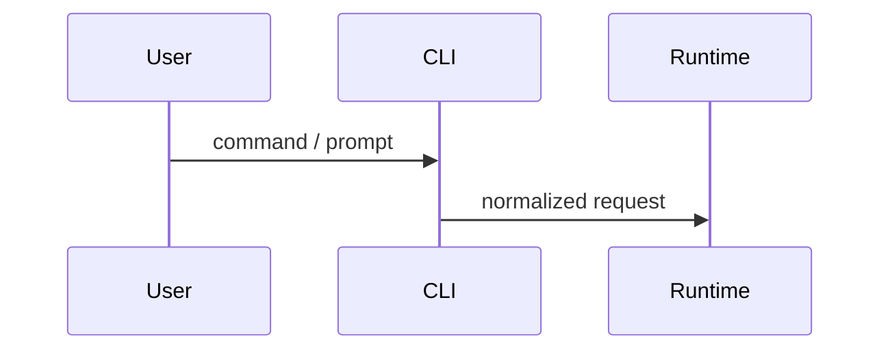

# CC Code Explorer

Use this skill for source-grounded deep dives into Claude Code mechanisms.

## Scope

This is not a general code explanation skill. Its job is to produce reliable mechanism analysis for the `cc` practice project, then hand off to `cc-job-wiki-source` when the analysis is ready to become a source document.

## Workflow

1. **Define the mechanism**
   - Name the feature precisely, such as `上下文压缩`, `工具调用权限判定`, `Skill 加载`, `MCP 插件加载`, `Slash Command 处理`.
   - State what behavior is in scope and out of scope.

2. **Find entry points**
   - Use `rg` to search user-facing command names, type names, config keys, function names, and event names.
   - Read nearby tests or schemas when available.
   - Identify at least one concrete entry file and one downstream core implementation file.

3. **Trace the call chain**
   - Follow control flow until the behavior reaches its state mutation, external call, model interaction, or rendered output.
   - Capture important data structures and type boundaries.
   - Note error paths, permission checks, caching, persistence, and telemetry if present.

4. **Separate fact from inference**
   - `源码确认`：directly supported by code.
   - `合理推断`：likely intent inferred from naming or structure.
   - `待验证`：requires runtime test, hidden config, or missing context.

5. **Produce an analysis artifact**
   - Use the approved documentation location:

```text
docs/wiki-source/cc/analysis/<topic-slug>.md
```

The analysis artifact must preserve the discovery process. It is not enough to present the final call chain.

## Analysis Template

```markdown
# Claude Code：<机制名> 源码解析

## TL;DR
用 2-4 句话说明这个机制是什么、为什么对 Agent Harness 有价值。

## Learning Question
这次精读要回答什么设计问题？例如：Claude Code 为什么需要显式 agent loop，而不是一次性模型调用？

## Scope
- 本文覆盖：
- 本文不覆盖：

## Reading Path
按实际探索顺序说明：
1. 先搜索了哪些关键词 / 符号。
2. 为什么选中这些入口文件。
3. 哪些路径被排除，为什么。

## Source Entry Points
| 入口 | 文件 | 符号 / 线索 | 作用 |
|---|---|---|---|

## Discovery Log
按发现顺序记录源码事实：
1. 在 `src/...` 发现 ...
2. 由此继续追到 `src/...`
3. 这一步说明 ...

## Core Call Chain
1. `file.ts:function`：...
2. `file.ts:function`：...

## Design Reconstruction
从源码事实推导架构设计：
- 这个机制为什么需要这些模块边界？
- 状态为什么这样传递？
- 哪些复杂度被隔离到了下游层？

## Key Data Structures
说明核心类型、字段、状态枚举、配置项。

## Execution Flow
按实际调用顺序解释流程。

## Error / Edge Paths
记录失败、取消、权限拒绝、降级、重试、压缩遗漏等路径。

## Design Takeaways
提炼可迁移到个人 Agent 项目的工程模式。

## Interview Value
说明它可能支撑哪些候选面试能力方向、项目深挖或场景题。不要假设当前会话能看到 JOB-WIKI 现有词条。

## Evidence
- `src/...`：说明证据

## Open Questions
- 待验证问题
```

## Standards

- Include concrete file paths for every important claim.
- Avoid long code dumps; quote only small snippets when necessary.
- Prefer call-chain tables and state diagrams over prose when flow is complex.
- If runtime behavior is unclear, hand off to `cc-practice-lab`.
- If the document is ready for JOB-WIKI, hand off to `cc-job-wiki-source`.

## Mermaid

Use Mermaid for non-trivial flows:


