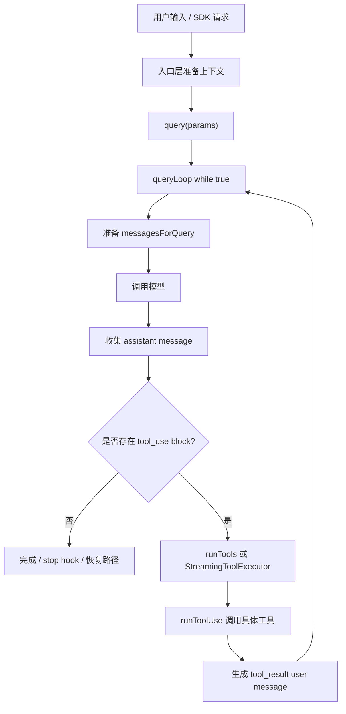

# Claude Code：Agent Loop 源码解析

## TL;DR

这次精读不是为了背出“Claude Code 有一个 agent loop”，而是为了回答一个更具体的问题：一个 coding agent 为什么不能只是“调用一次模型”，而要有一套可持续推进的主循环、消息协议、工具调度和入口包装。通过 `src/query.ts`、`src/QueryEngine.ts`、`src/screens/REPL.tsx`、`src/Tool.ts` 和 `src/services/tools/` 的调用链，可以复原出 Claude Code 的核心设计：把模型输出、工具调用、工具结果、恢复路径和 UI/SDK 事件都组织到一个基于 transcript 的异步状态机里。

## Learning Question

最初的问题是：如果我要自己实现一个 Claude Code-like agent，第一课到底应该写什么？

直觉上可能会写一个函数：

```text
用户输入 -> 调模型 -> 打印结果
```

但 Claude Code 是 coding agent，不是聊天包装器。它至少要解决这些问题：

- 模型什么时候继续，什么时候停止？
- 模型要调用工具时，工具请求如何表示？
- 工具执行结果如何回到模型上下文？
- UI、SDK、headless 模式如何复用同一个核心 loop？
- 后续权限、上下文压缩、错误恢复应该挂在哪些边界上？

所以这次源码阅读的目标是找到 Claude Code 对这些问题的最小主干设计。

## Scope

- 本文覆盖：
  - `query()` / `queryLoop()` 的主状态机。
  - REPL / SDK 如何进入核心 loop。
  - `tool_use` / `tool_result` 如何驱动下一轮。
  - 工具执行为什么下沉到 `services/tools`。
  - 这套源码事实如何指导 `mini-cc` 第一课的架构。
- 本文不覆盖：
  - 上下文压缩完整算法。
  - permission / hook 的完整优先级。
  - `StreamingToolExecutor` 的完整并发细节。
  - 单个复杂工具内部实现。

## Reading Path

1. 先从命名上找核心入口：搜索 `query`、`queryLoop`、`while (true)`，定位到 `src/query.ts`。
2. 在 `src/query.ts:219` 看到 `query()` 是异步生成器入口，在 `src/query.ts:241` 看到真正实现是 `queryLoop()`。
3. 在 `src/query.ts:307` 看到显式 `while (true)`，确认这不是一次模型调用，而是跨轮状态机。
4. 接着追“谁调用 query”：在 `src/QueryEngine.ts:675` 看到 SDK/headless 入口用 `for await (const message of query(...))` 消费事件；在 `src/screens/REPL.tsx:2392` 看到 REPL 构造 `getToolUseContext()`，后续多处调用核心 query。
5. 再追“模型如何要求工具”：在 `src/query.ts:557` 附近看到 `toolUseBlocks` 和 `needsFollowUp`，在 `src/query.ts:833` 附近看到 assistant message 中的 `tool_use` 被收集。
6. 再追“工具如何执行”：在 `src/query.ts:1382` 看到进入 `runTools()` 或 `StreamingToolExecutor`；在 `src/services/tools/toolOrchestration.ts:19` 看到工具调度层；在 `src/services/tools/toolExecution.ts` 看到单工具执行层。
7. 最后追“下一轮如何形成”：在 `src/query.ts:1728` 之前的状态推进逻辑中，下一轮基于当前消息、assistant 输出和 tool result 继续循环。

这条阅读路径说明：Agent Loop 的主干不是某个工具，也不是某个 UI，而是 `query.ts` 里的状态推进协议。

## Source Entry Points

| 入口 | 文件 | 符号 / 线索 | 作用 |
|---|---|---|---|
| 核心 loop | `src/query.ts:219` | `query()` | 对外暴露异步生成器。 |
| 核心实现 | `src/query.ts:241` | `queryLoop()` | 维护跨轮状态和终止路径。 |
| 主循环 | `src/query.ts:307` | `while (true)` | 显式状态机，不是一次调用。 |
| SDK/headless | `src/QueryEngine.ts:675` | `for await (const message of query(...))` | 消费核心 loop 事件。 |
| REPL/UI | `src/screens/REPL.tsx:2392` | `getToolUseContext()` | 构造工具运行上下文。 |
| 工具协议 | `src/Tool.ts:158` | `ToolUseContext` | 工具执行依赖的上下文边界。 |
| 工具调度 | `src/services/tools/toolOrchestration.ts:19` | `runTools()` | 多工具调度层。 |
| 单工具执行 | `src/services/tools/toolExecution.ts` | `runToolUse()` | 工具查找、权限、调用和结果映射。 |

## Discovery Log

1. 在 `src/query.ts:219` 发现 `query()` 返回 `AsyncGenerator`。这说明核心 loop 不是直接返回最终字符串，而是持续向外发事件，方便 REPL、SDK、日志和恢复逻辑共享。
2. 在 `src/query.ts:307` 发现 `while (true)`。这一步确认 agent loop 的本质是跨轮推进：每轮调用模型，根据输出决定是否继续。
3. 在 `src/query.ts:557` 发现 `toolUseBlocks` 和 `needsFollowUp`。这把“是否继续”的判断从 API 高层字段拉回到结构化消息内容。
4. 在 `src/query.ts:833` 附近看到 assistant message 里的 `tool_use` 被收集。这里说明模型不是直接执行工具，而是写出协议块，由 harness 接管执行。
5. 在 `src/query.ts:1382` 看到工具执行被交给 `StreamingToolExecutor` 或 `runTools()`。这说明 query loop 不直接拥有工具细节。
6. 在 `src/services/tools/toolOrchestration.ts:19` 看到 `runTools()`，这一步把“工具调度”从“主循环”里剥离出来。
7. 在 `src/Tool.ts:158` 看到 `ToolUseContext`，说明工具不是裸函数，它需要 cwd、权限、app state、MCP、abort 等运行上下文。
8. 在 `src/QueryEngine.ts:675` 和 `src/screens/REPL.tsx:2392` 看到不同入口复用同一个 query。由此可以推断 Claude Code 的边界是：入口层负责交互形态，`query.ts` 负责 agent 状态推进。

## Core Call Chain

1. `src/screens/REPL.tsx` 或 `src/QueryEngine.ts` 准备消息、系统提示和 `ToolUseContext`。
2. 入口层调用 `src/query.ts:query()`。
3. `query()` 委托 `queryLoop()`。
4. `queryLoop()` 初始化 `State`，进入 `while (true)`。
5. 每轮根据当前 messages 准备模型输入，并处理预算、上下文、恢复等前置逻辑。
6. 模型 streaming 产出 assistant message。
7. 如果 assistant message 中没有真实 `tool_use`，进入完成、stop hook、错误恢复或预算路径。
8. 如果出现 `tool_use`，收集为 `toolUseBlocks`。
9. 工具执行进入 `StreamingToolExecutor` 或 `runTools()`。
10. 单个工具执行形成 `tool_result`。
11. `tool_result` 作为新的 user message 回填 transcript。
12. 下一轮基于新的 transcript 继续。

## Design Reconstruction

从源码可以复原出几个设计选择。

第一，Claude Code 把 loop 暴露成 `AsyncGenerator`，不是普通 Promise。原因是 coding agent 的一次请求中间会产生很多事件：assistant 文本、tool use、tool result、权限请求、错误恢复、token 预算提示。入口层不应该等所有事情结束才拿结果。

第二，`query.ts` 只负责状态推进，不负责具体工具行为。工具执行被放到 `src/services/tools/`，具体工具在 `src/tools/`。这样后续加入权限、hook、并发安全、工具结果展示时，不会把主 loop 变成工具细节的大杂烩。

第三，继续条件依赖结构化 `tool_use`，不是只依赖 `stop_reason`。这体现了生产级 harness 的一个原则：transcript 中的结构化事实比 API 的高层状态字段更可靠。

第四，`ToolUseContext` 是工具边界的关键。工具不是简单 `(input) => output`，它运行在一个会话上下文里，后续权限、cwd、MCP client、abort controller、UI 更新能力都会放进这个边界。

## Key Data Structures

- `State`：`queryLoop()` 的跨迭代状态，保存消息、turn count、恢复状态、压缩状态和 transition。
- `ToolUseContext`：工具执行上下文，是工具层和会话层之间的接口。
- `AssistantMessage`：模型输出，可能包含 `text`、`thinking`、`tool_use`。
- `ToolUseBlock`：模型请求工具调用的结构化块，关键字段是 `id`、`name`、`input`。
- `tool_result`：工具结果块，通过 `tool_use_id` 回连到 `tool_use.id`。

## Execution Flow



## Error / Edge Paths

- `stop_reason === 'tool_use'` 不可靠，主 loop 以真实 `tool_use` block 作为继续信号。
- 已产生 tool use 后发生 streaming fallback，需要处理 orphan assistant message，避免 transcript 不一致。
- 工具失败也要尽量变成协议内 `tool_result`，否则下一轮模型无法理解发生了什么。
- max turns、prompt too long、media too large、max output tokens 都会进入不同的停止或恢复路径。

## Build-Along Implication

如果第一课只是写一个 `main.ts` 调 mock 模型，就学不到 Claude Code 的架构。根据上面的源码事实，`mini-cc` 第一课至少应保留这些边界：

- `mini-cc/src/query.ts`：保留核心 loop。
- `mini-cc/src/QueryEngine.ts`：保留入口包装。
- `mini-cc/src/Tool.ts`：保留工具协议和上下文。
- `mini-cc/src/services/api/mockClaude.ts`：保留模型 provider 边界。
- `mini-cc/src/services/tools/toolExecution.ts`：保留单工具执行层。
- `mini-cc/src/services/tools/toolOrchestration.ts`：保留工具调度层。
- `mini-cc/src/tools/BashTool.ts`：放具体工具实现。

这些边界不是为了形式相似，而是为了让后续课程能自然加入权限、上下文压缩、session resume 和插件系统。

## Source Confirmed

- `src/query.ts:219`：`query()` 是异步生成器入口。
- `src/query.ts:241`：`queryLoop()` 是核心实现。
- `src/query.ts:307`：主循环是显式 `while (true)`。
- `src/query.ts:557`：`toolUseBlocks` 和 `needsFollowUp` 是继续信号。
- `src/query.ts:833`：assistant message 中的 `tool_use` 被收集。
- `src/query.ts:1382`：工具执行进入 `StreamingToolExecutor` 或 `runTools()`。
- `src/services/tools/toolOrchestration.ts:19`：`runTools()` 是工具调度层。
- `src/Tool.ts:158`：`ToolUseContext` 是工具上下文边界。
- `src/QueryEngine.ts:675`：SDK/headless 通过 `for await` 消费 query 事件。

## Reasonable Inference

- 显式 `State` 和 `transition` 是为了集中管理继续、停止、恢复和测试断言。
- `tool_use` / `tool_result` 配对完整性是 resume、错误恢复和下一轮模型调用的基础约束。
- 工具调度独立成服务层，是为了把并发、权限、hook、context modifier 等复杂度从主 loop 中隔离出去。

## Open Questions

- `StreamingToolExecutor` 的排序、取消、context modifier 合并需要单独精读。
- permission hook、pre tool hook、post tool hook 如何插入 `runToolUse()` 需要下一阶段追踪。
- auto compact / microcompact 如何改写 `messagesForQuery` 需要放到上下文压缩主题中继续分析。
