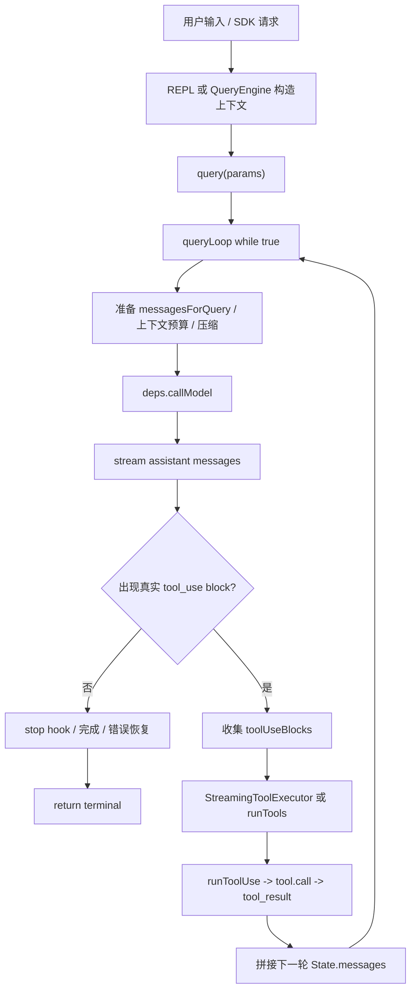

# Claude Code：Agent Loop 源码解析

## TL;DR

Claude Code 的 agent loop 核心在 `src/query.ts` 的 `query()` / `queryLoop()`。它用一个显式 `while (true)` 状态机反复执行“准备上下文 -> 调模型 -> 收集 `tool_use` -> 执行工具 -> 回填 `tool_result` -> 进入下一轮”，直到没有真实 `tool_use`、触发 max turns、abort、hook、上下文限制或其他终止路径。

这个机制的工程价值在于：它把模型调用、工具执行、上下文处理、权限、错误恢复和 UI/SDK 事件输出统一到一个可恢复的异步生成器协议里，是 Agent Harness 的主干。

## Scope

- 本文覆盖：
  - REPL / SDK 如何进入 `query()`。
  - `queryLoop()` 的主状态机。
  - 模型 streaming 输出如何变成 assistant message 与 `tool_use`。
  - `tool_use` 如何执行并回填 `tool_result`。
  - agent loop 的主要架构边界。
- 本文不覆盖：
  - 单个工具内部实现。
  - 上下文压缩完整算法。
  - 权限分类器和 hook 系统完整链路。
  - StreamingToolExecutor 的完整并发细节。

## Source Entry Points

| 入口 | 文件 | 符号 / 线索 | 作用 |
|---|---|---|---|
| 核心 loop | `src/query.ts` | `query()` / `queryLoop()` / `while (true)` | Claude Code agent loop 主体。 |
| SDK/headless 入口 | `src/QueryEngine.ts` | `for await (const message of query(...))` | 包装会话、transcript、SDK 输出。 |
| REPL 入口 | `src/screens/REPL.tsx` | `getToolUseContext()` / `query()` | 交互式 UI 构造工具上下文并消费事件。 |
| 工具调度 | `src/services/tools/toolOrchestration.ts` | `runTools()` | 根据工具并发安全性串行或并发执行。 |
| 单工具执行 | `src/services/tools/toolExecution.ts` | `runToolUse()` | 权限、hook、`tool.call()`、结果映射。 |
| 模型适配 | `src/services/api/claude.ts` | `queryModelWithStreaming()` | 把 Anthropic streaming 事件适配为内部消息。 |
| 工具上下文 | `src/Tool.ts` | `ToolUseContext` | 携带 tools、权限、app state、abort、mcp、agent 信息。 |

## Core Call Chain

1. `src/screens/REPL.tsx` 或 `src/QueryEngine.ts` 构造 `ToolUseContext`、system prompt、user context。
2. 入口层调用 `src/query.ts:query()`。
3. `query()` 委托 `queryLoop()`，并在正常结束后标记 queued command completed。
4. `queryLoop()` 初始化 `State`，进入 `while (true)`。
5. 每轮基于当前 `state.messages` 处理上下文窗口、预算、压缩和附件。
6. `queryLoop()` 调 `deps.callModel()`；生产依赖指向 `queryModelWithStreaming()`。
7. streaming 过程中产生 assistant message；如果 message 中有 `tool_use` block，则加入 `toolUseBlocks`，并把 `needsFollowUp` 设为 true。
8. 如果没有 `tool_use`，进入 stop hook、token budget 或完成路径。
9. 如果有 `tool_use`，调用 `StreamingToolExecutor.getRemainingResults()` 或 `runTools()`。
10. `runTools()` 按 `isConcurrencySafe()` 分批执行工具。
11. `runToolUse()` 执行工具并生成含 `tool_result` 的 user message。
12. `queryLoop()` 用 `messagesForQuery + assistantMessages + toolResults` 构造下一轮 `State`，继续循环。

## Key Data Structures

- `State`：`queryLoop()` 的跨迭代状态，包含 `messages`、`toolUseContext`、`turnCount`、压缩状态、恢复计数和 `transition`。
- `QueryParams`：`query()` 输入，包含初始消息、系统提示、上下文、权限函数、工具上下文和依赖注入。
- `ToolUseContext`：工具运行上下文，包含工具集合、MCP client、app state、abort controller、权限和 UI 更新能力。
- `AssistantMessage`：模型输出的内部消息，可能包含 `text`、`thinking`、`tool_use` 等 block。
- `ToolUseBlock`：模型请求执行工具的结构化块，关键字段是 `id`、`name`、`input`。
- `tool_result`：工具执行结果必须用 `tool_use_id` 回连到对应 `tool_use.id`。

## Execution Flow

## Architecture Notes

- `query.ts` 只拥有核心 agent loop 和状态推进，不直接拥有具体工具实现。
- `QueryEngine.ts` 是 SDK/headless 的会话包装层，不应该复制 loop。
- `REPL.tsx` 是交互式 UI 包装层，负责 UI state、permission dialog、input 处理，不拥有核心 loop。
- `Tool.ts` 是工具协议和工具上下文边界。
- `services/tools` 是工具执行和调度层。
- `services/api` 是模型 API 适配层。

这个分层说明 Claude Code 的核心不是“一个函数调用模型”，而是一套 harness 边界：入口层、核心 loop、模型适配层、工具调度层、工具实现层、UI/SDK 消费层分开演进。

## Error / Edge Paths

- `stop_reason === 'tool_use'` 不可靠，主循环以是否实际看到 `tool_use` block 判断是否继续。
- streaming fallback 时会 tombstone 已经产生的 orphan assistant message，避免旧 `tool_use_id` 泄漏。
- 模型调用已经输出 `tool_use` 后如果发生错误，需要补齐缺失的 `tool_result`，避免 transcript 不完整。
- max turns 会在准备下一轮前返回 `max_turns_reached` attachment。
- prompt too long / media too large / max output tokens 等路径会进入 withheld、reactive compact 或恢复逻辑。

## Source Confirmed

- `src/query.ts:219`：`query()` 是异步生成器入口。
- `src/query.ts:241`：`queryLoop()` 是核心实现。
- `src/query.ts:307`：主循环是显式 `while (true)`。
- `src/query.ts:551` 附近：`toolUseBlocks` 和 `needsFollowUp` 是 loop continuation 的核心信号。
- `src/query.ts:826` 附近：assistant message 中的 `tool_use` 被收集。
- `src/query.ts:1382` 附近：工具执行进入 `StreamingToolExecutor` 或 `runTools()`。
- `src/query.ts:1714` 附近：下一轮 state 使用 `messagesForQuery + assistantMessages + toolResults`。
- `src/services/tools/toolOrchestration.ts:19`：`runTools()` 根据并发安全性调度工具。
- `src/QueryEngine.ts` 中 `for await (const message of query(...))`：SDK/headless 消费核心 loop 事件。

## Reasonable Inference

- Claude Code 选择显式 `State` 和 `transition`，是为了把多种恢复路径、继续原因和测试断言集中管理，而不是分散在递归或多处局部变量里。
- `tool_use` / `tool_result` 配对完整性是 agent loop 的硬约束，因为错误恢复、resume 和 API 请求都依赖 transcript 合法。
- 工具调度层独立于 loop，是为了让并发、权限、hook、context modifier 等工具执行复杂度不污染 `queryLoop()` 主状态机。

## Design Takeaways

- 主循环应该围绕消息协议设计，而不是围绕工具实现设计。
- 入口层、模型层、工具层、UI 层要分开，否则后续上下文压缩、权限和恢复会互相污染。
- 判断 loop 是否继续，应基于真实结构化输出，而不是只相信模型 API 的高层 stop reason。
- 即使工具失败，也要把失败变成协议内的 `tool_result`，让下一轮模型有机会恢复。
- 简化实现第一课应保留这些边界：`query.ts`、`QueryEngine.ts`、`Tool.ts`、`services/api`、`services/tools`。

## Interview Value

这份机制可支撑的候选能力方向：

- Agent Harness 主循环设计。
- 工具调用协议和 `tool_use` / `tool_result` 配对。
- 异步事件流与 UI/SDK 解耦。
- 工具调度和副作用安全。
- 生产级 Agent 的错误恢复与会话一致性。

## Open Questions

- `StreamingToolExecutor` 的完整启动、排序、取消和 context modifier 合并需要单独精读。
- stop hook、pre tool hook、post tool hook、permission hook 的优先级需要单独整理。
- auto compact / microcompact 在每轮模型调用前如何介入，需要在上下文压缩主题中继续分析。
