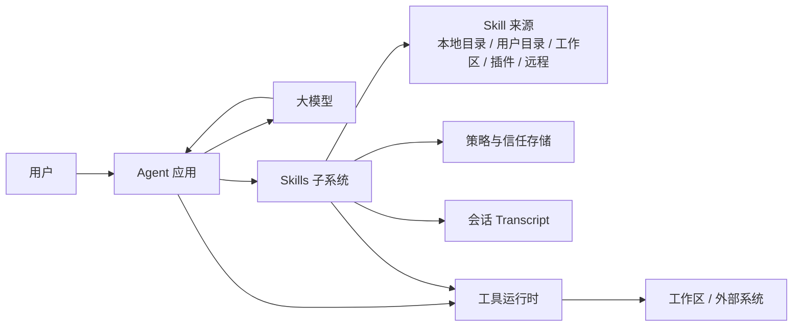
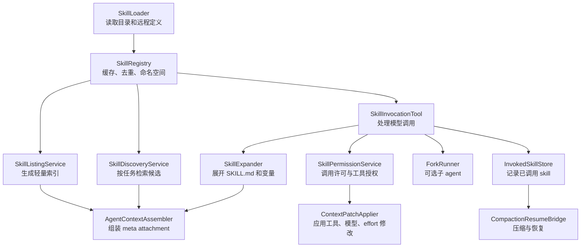

# Claude Code Skills 技术方案：面向外部系统的可复现 Agent Skills 架构

## 如何阅读本文

本文是一份实现方案，不是源码阅读笔记。推荐按两条路径阅读：

- **快速判断路径**：读本节、§ Learning Question、§ Scope、§ 0 设计摘要、§ 1 全局心智模型 和 § 17.1 MVP。目标是在 30 分钟内判断这套机制是否值得引入，以及最小落地需要哪些模块。
- **实现路径**：从 § 2 系统上下文架构 顺序读到 § 16 测试计划。每个模块都给出职责边界、协议形状和可直接迁移到工程代码的 TypeScript 骨架。

本文的关键设计已对照 Claude Code 源码校验；需要核验具体依据时，见文末"附录 A：设计来源校验"。正文按外部系统实现组织，读者不需要先读 Claude Code 源码。

**文档地图：**

| 目标 | 主要章节 |
|---|---|
| 判断值不值得做 | § 0 设计摘要、§ 1 全局心智模型、§ 17.1 MVP |
| 设计数据结构和模块边界 | § 2 系统上下文架构、§ 3 Skill 包格式、§ 4 数据模型与协议 |
| 实现核心链路 | § 5 加载与注册设计 → § 11 Compaction 与 Resume |
| 上生产 | § 12 安全与信任边界、§ 14 运维观测与治理、§ 16 测试计划 |
| 扩展生态 | § 13 插件、远程与 MCP 扩展、§ 18 迁移策略 |

先记住这张最小闭环图——后文所有模块都围绕它展开：

```text
skills/<name>/SKILL.md
        |
        v
SkillLoader -> SkillRegistry -> SkillListing
        |                         |
        |                         v
        |                  meta listing message
        v
SkillTool(name,args) -> SkillExpander -> meta skill message
        |                  |
        v                  v
PermissionService     ContextPatch
        |
        v
Transcript + InvokedSkillStore
```

## Learning Question

本文回答一个可以脱离 Claude Code 源码独立使用的工程问题：

```text
如果一个应用也想支持 Claude Code 风格的 agent skills，
应该如何设计 skill 包格式、发现机制、加载协议、权限边界、
上下文注入、会话持久化和运维治理？
```

`skill` 不是普通函数工具，也不是硬编码 prompt，更准确的理解是：

```text
一个可发现、可权限控制、可按需加载、可随会话持久化的上下文能力包。
```

它把领域工作流从系统提示词中拆出来，让 agent 在需要时主动加载。一个成熟的 skills 子系统需要同时解决四类问题：

- **能力组织**：如何把工作流、说明、模板、脚本和策略打包成可复用单元。
- **上下文效率**：如何只暴露轻量索引，避免把所有 skill 全文塞进 prompt。
- **安全边界**：如何管控 skill 的调用权限、工具授权和脚本执行范围。
- **生命周期**：如何在上下文压缩、会话恢复、插件更新和版本升级后保持行为稳定。

## Scope

**本文覆盖：**

- 一套可复现的 skill 包格式。
- agent skills 子系统的全局架构。
- loader、registry、listing、discovery、invocation、permission、expansion、persistence 各模块的职责边界。
- inline skill 与 forked skill 的运行协议。
- 可直接使用的 TypeScript 参考实现骨架。
- 测试、观测、安全、部署和迁移方案。
- 可选的设计来源校验附录（面向外部分发时可整体删除）。

目标读者是正在建设外部 agent 系统的工程团队，覆盖 IDE agent、企业工作流 agent、数据分析 agent、客服 agent、运维 agent、低代码平台 agent、内部知识库 agent 等场景。读者不需要依赖任何教学项目、源码学习项目或特定目录结构。

**本文不覆盖：**

- 远程 skill 市场的完整产品设计。
- 复杂检索排序算法的完整实现。
- 特定产品 UI 的交互稿。
- 某个演示项目或特定代码库的实现细节。

## 0. 设计摘要

### 0.1 核心方案

在 agent 应用中增加一个 `Skill` 工具。模型平时只看到 skill 的名称、描述和适用条件；当模型决定调用某个 skill 时，应用把完整 `SKILL.md` 展开为一条 meta user message 注入下一轮上下文，并同步应用该 skill 声明的工具权限、模型偏好和执行模式。

### 0.2 关键设计取舍

一个容易踩坑的实现是：模型调用 `Skill(review-pr)`，工具直接把完整 `SKILL.md` 作为 tool result 返回。

这个实现看起来简单，但它混淆了两类东西：

- tool result 是一次工具调用的协议结果，语义上类似“工具执行完成，并返回观察结果”。
- skill 正文是后续行为指令，语义上类似“从下一轮开始，请按这份工作手册行动”。

如果把完整 skill 正文塞进 tool result，agent loop 后面会很难判断：这段内容到底是工具观察结果、模型应该引用的资料，还是下一轮必须遵守的指令。权限审计、压缩恢复、调试面板也缺少明确对象。

因此，推荐把一次 inline skill 调用的结果建模为 `SkillInvocationEffect`。它不是单纯的“工具返回值”，而是一次 skill 调用对 agent loop 产生的三类效果：

```ts
type SkillInvocationEffect = {
  toolResult: ToolResultMessage      // 工具协议闭环
  injectedMessages: AgentMessage[]   // 真正的行为指令
  contextPatch?: AgentContextPatch   // 运行时环境变更
}
```

- `toolResult`：负责完成工具协议闭环。它应该短，只告诉模型 skill 已经启动，例如 `Launching skill: review-pr`。
- `injectedMessages`：负责承载真正的行为指令。完整 `SKILL.md` 展开后进入这里，通常是一条 `isMeta: true` 的 user message。
- `contextPatch`：负责修改当前 agent 的运行环境。比如这个 skill 获准后可以使用哪些工具、是否切换模型、是否提高推理强度。

例如，模型调用：

```json
{
  "skill": "review-pr",
  "args": "PR #123"
}
```

应用侧可以生成这样的 effect：

```ts
const effect: SkillInvocationEffect = {
  toolResult: {
    role: 'tool',
    toolUseId: 'call_01',
    content: 'Launching skill: review-pr',
  },
  injectedMessages: [
    {
      role: 'user',
      isMeta: true,
      content: [
        '<skill name="review-pr" source="workspace">',
        'Base directory: /repo/.agent/skills/review-pr',
        '',
        '# Review PR Skill',
        'You are reviewing PR #123.',
        'First inspect the diff, then check tests, risks, and user-visible behavior.',
        'Return findings first, ordered by severity.',
        '</skill>',
      ].join('\n'),
    },
  ],
  contextPatch: {
    allowedTools: [
      { tool: 'git', pattern: 'diff' },
      { tool: 'github.fetch_pr' },
    ],
    modelOverride: 'default',
    effortOverride: 'high',
  },
}
```

这段示例里，`toolResult` 只负责让工具调用在 transcript 中闭合；`injectedMessages` 才是模型下一轮要遵守的完整审查流程；`contextPatch` 则把 skill 声明的运行时能力变成结构化配置。三者分开后，系统可以分别做权限确认、审计记录、压缩恢复和调试展示。

## 1. 全局心智模型

### 1.1 关键术语

在进入模块细节前，先对齐几个贯穿全文的术语：

- **meta message**：agent loop 中由应用编排层注入的特殊上下文消息。它不来自用户输入，也不是普通工具结果，用于向模型补充 skill 索引、skill 正文或会话恢复信息。
- **`isMeta: true`**：标记一条消息属于编排层注入，应进入模型上下文，但在产品语义上不是用户发言。
- **context patch**：对当前 agent loop 运行时环境的临时结构化修改，包括工具白名单、模型选择、推理强度、hook 配置等。
- **ContextPatchApplier**：负责将 context patch 应用到 agent 运行时的组件。它不解析 skill，只负责把已获准的环境变更挂载到当前 agent 或子 agent 上。
- **inline skill**：把完整 skill 指令注入当前 agent 上下文，由当前 agent 继续执行。
- **forked skill**：启动独立子 agent 执行 skill，完成后把摘要结果返回给父 agent。

### 1.2 Skill 是上下文能力包

普通工具的职责是"执行动作并返回结果"——`read_file(path)` 返回文件内容，`search(query)` 返回搜索结果，工具边界清晰。

Skill 的职责是"改变 agent 接下来如何工作"。一个 skill 通常包含：

- **触发条件**：什么情况下应该使用这个 skill。
- **工作流**：按什么顺序收集上下文、调用工具、检查结果。
- **输出契约**：最终应交付什么格式，质量标准是什么。
- **安全约束**：哪些工具可用，哪些操作必须先征得用户确认。
- **辅助资产**：模板、脚本、schema、示例、检查表等。

调用一个 skill，更像"临时加载一份领域操作手册"，而不是"调用一个普通 API"。

### 1.3 两阶段上下文进入

最简单的做法是把所有 skill 全文直接放进系统提示词，但这个方案有三个明显问题：

- **token 浪费**：绝大多数 skill 与当前任务无关。
- **注意力污染**：模型同时看到大量互相竞争的工作流，容易混用。
- **权限模糊**：某个 skill 的工具授权可能被错误泛化到无关任务。

推荐的替代方案是两阶段机制：

```text
阶段一：轻量索引（每轮默认注入）
只给模型看 name、description、when_to_use、argument hint。

阶段二：按需展开（模型主动调用后触发）
模型调用 Skill 工具，应用才展开完整 SKILL.md。
```

轻量索引让模型了解有哪些能力可用；按需展开让每轮上下文只包含当前任务真正需要的内容。

### 1.4 Inline 与 Fork 两种执行模式

**Inline skill** 把完整指令注入当前 agent 上下文：

```text
当前 agent -> 调用 Skill -> 注入 SKILL.md -> 当前 agent 继续工作
```

适合：代码审查、文档编辑、数据分析、查询改写、领域流程执行等需要保留完整推理轨迹的任务。

**Forked skill** 启动独立子 agent：

```text
当前 agent -> 调用 Skill -> 子 agent 独立执行 -> 父 agent 收到摘要结果
```

适合：长时间探索、并行任务、不希望大量中间步骤污染主上下文的场景。

### 1.5 Skill 的生命周期

一个 skill 从磁盘或远程来源进入 agent 应用后，经历以下七个状态：

```text
Discovered -> Loaded -> Indexed -> Listed -> Invoked -> Persisted -> Restored
```

| 状态 | 说明 |
|---|---|
| `Discovered` | 找到候选 skill 目录或远程定义 |
| `Loaded` | 解析 `SKILL.md` 和 frontmatter |
| `Indexed` | 登记到 registry，完成去重、排序、命名空间处理 |
| `Listed` | 以轻量形式暴露给模型（仅名称、描述等） |
| `Invoked` | 模型调用 `Skill` 工具，完整内容被展开注入 |
| `Persisted` | 已调用记录写入会话状态 |
| `Restored` | 上下文压缩或会话恢复后重新注入必要 skill |

### 1.6 必须避开的常见失败模式

这些失败模式会在实现各模块时反复出现，建议先建立清晰认知，再进入细节：

| 失败模式 | 症状 | 修复方向 |
|---|---|---|
| Skill 全文进入 listing | 上下文膨胀，模型混用多个 skill 的规则 | listing 只包含名称、描述、适用条件和参数提示 |
| Skill 只返回 tool result | 模型把 skill 当普通工具，不稳定遵循流程 | 完整 skill 内容必须作为 meta user message 注入后续上下文 |
| `allowed-tools` 只是自然语言 | 模型以为自己有权限，工具运行时却不知道 | 将工具授权解析为结构化 `ToolRule[]`，由 permission layer 生效 |
| 压缩后忘记 skill | 长会话前半段遵守流程，压缩后约束突然丢失 | 记录 invoked skills，compaction/resume 后重新注入 |
| Workspace skill 自动信任 | 克隆陌生仓库后，恶意 skill 请求危险工具 | workspace skill 首次调用必须 ask，并展示来源、哈希和工具权限 |

## 2. 系统上下文架构

### 2.1 系统上下文图



Skills 子系统既不是模型的一部分，也不是工具运行时的一部分。它位于应用编排层，职责是把 skill 定义翻译成模型可见的上下文和运行时策略。

### 2.2 组件图



每个模块都应该可以独立测试。不要把解析、权限判断、上下文注入和 agent loop 混进一个大函数——这个决定在接入插件、远程 skill 和审计日志时会被反复验证。

### 2.3 模块职责总表

| 模块 | 职责 | 不应该做什么 |
|---|---|---|
| `SkillLoader` | 读取 skill 来源，解析 `SKILL.md` 和 frontmatter | 不判断是否应该调用 |
| `SkillRegistry` | 保存 normalized skill，处理命名空间、去重、覆盖规则 | 不拼接 prompt |
| `SkillListingService` | 生成模型可见的轻量 skill 列表 | 不暴露 skill 全文 |
| `SkillDiscoveryService` | 根据任务、文件、上下文推荐少量相关 skill | 不绕过权限直接注入全文 |
| `SkillInvocationTool` | 实现模型可调用的 `Skill` 工具协议 | 不执行任意脚本 |
| `SkillExpander` | 展开正文、参数、变量、资源路径 | 不决定工具是否可用 |
| `SkillPermissionService` | 处理调用许可、来源信任、工具授权 | 不修改 transcript |
| `ContextPatchApplier` | 将 allowed tools、model、effort 生效到 agent loop | 不解析 skill 文件 |
| `InvokedSkillStore` | 记录已调用 skill，供压缩恢复使用 | 不保存敏感密钥明文 |
| `SkillTelemetry` | 记录调用、错误、耗时、权限决策 | 不记录完整私密内容（除非用户授权） |

## 3. Skill 包格式

### 3.1 目录规范

每个 skill 是一个独立目录，`SKILL.md` 是唯一入口文件：

```text
.agent/
  skills/
    review-pr/
      SKILL.md
      checklist.md
      templates/
        review-output.md
      scripts/
        collect-context.sh
    sql-lineage/
      SKILL.md
      templates/
        lineage-query.sql
      schemas/
        lineage-result.schema.json
```

上面的 `.agent/skills` 是外部系统示例路径。Claude Code 源码确认的实际路径是：

- 用户级：`~/.claude/skills/<name>/SKILL.md`
- 项目级：`.claude/skills/<name>/SKILL.md`
- 管理策略级：`<managed>/.claude/skills/<name>/SKILL.md`
- 兼容旧入口：`.claude/commands` 下的 prompt command / `SKILL.md`

几条重要约定：

- 同目录资源（`templates/`、`schemas/`、`scripts/`）不会自动全部进入上下文，只有在 skill 正文明确引用时才被读取或执行。
- 目录名即调用名，应短小稳定、适合模型引用，例如 `review-pr`、`sql-lineage`、`incident-triage`。
- 这个格式可以直接映射到任意 agent 应用，不依赖特定 IDE 或 CLI。

### 3.2 `SKILL.md` 基本结构

```markdown
---
name: review-pr
description: Review a pull request using the repository's engineering checklist.
when_to_use: Use when the user asks to review a PR, inspect code changes, or evaluate merge readiness.
argument-hint: "<pr-number-or-branch>"
arguments:
  - target
allowed-tools:
  - read_file
  - search_code
  - run_shell:git diff*
model: inherit
effort: medium
user-invocable: true
disable-model-invocation: false
context: inline
paths:
  - "app/**/*.ts"
  - "packages/**/*.tsx"
---

# Review PR Skill

## Goal

Produce a review that prioritizes correctness, regressions, security, and missing tests.

## Workflow

1. Identify the changed files.
2. Read the surrounding code before judging a change.
3. Check behavior, tests, permissions, and error paths.
4. Report findings first, ordered by severity.

## Output Contract

Return:

- Findings with file and line references.
- Open questions.
- Short summary only after findings.
```

正文的读者是 agent，不是人类教程读者。写法要明确、可执行、可检查——不要把 skill 写成营销文案或泛泛原则。

### 3.3 Frontmatter 字段说明

| 字段 | 类型 | 是否必需 | 说明 |
|---|---:|---:|---|
| `name` | string | 可选 | 显示名。贴近 Claude Code 时，模型调用名来自目录名或命名空间，而非此字段 |
| `description` | string | 建议必需 | listing 中展示的短描述。CC 对本地 skill 会从正文兜底提取，外部系统可选择更严格 |
| `when_to_use` | string | 建议必需 | 适用条件，帮助模型判断是否应该调用 |
| `argument-hint` | string | 可选 | 展示给用户或模型的参数提示 |
| `arguments` | string 或 string[] | 可选 | 结构化参数名列表 |
| `allowed-tools` | string 或 string[] | 可选 | skill 激活后临时允许的工具规则 |
| `model` | string | 可选 | 模型覆盖；`inherit` 表示沿用当前模型 |
| `effort` | string | 可选 | 推理强度建议 |
| `user-invocable` | boolean-like | 可选 | 是否允许用户显式调用；CC 只接受 literal `true` 或字符串 `"true"` |
| `disable-model-invocation` | boolean-like | 可选 | 是否禁止模型主动调用；同上，CC 只接受 literal `true` 或字符串 `"true"` |
| `context` | `inline` 或 `fork` | 可选 | 注入当前 agent，还是交给子 agent 执行 |
| `agent` | string | 可选 | `context: fork` 时指定子 agent 类型 |
| `paths` | string 或 string[] | 可选 | 文件路径命中后才激活 |
| `hooks` | object | 可选 | skill 激活后注册的 hook 配置；外部系统可先不实现 |
| `shell` | `bash` 或 `powershell` | 可选 | 执行 markdown inline shell expansion 时使用的 shell |
| `source` | string | 内部生成 | 来源标记：system、user、workspace、plugin、remote |
| `version` | string | 可选 | skill 版本号 |
| `hash` | string | 内部生成 | 内容哈希，用于审计和缓存失效 |

MVP 阶段只需实现目录名、`description`、`when_to_use`、`allowed-tools`、`context` 五个字段，其余字段可以保留在 schema 中，后续逐步生效。

### 3.4 Skill 正文写作规范

一份高质量的 `SKILL.md` 应包含：

- **目标**：这个 skill 要把任务完成到什么状态。
- **触发条件**：什么时候应该用，什么时候不应该用。
- **输入期望**：参数、文件、上下文或需要向用户收集的信息。
- **工作流**：清晰的步骤，而不是抽象原则。
- **工具策略**：哪些工具可用，何时需要用户确认。
- **输出契约**：最终回答、文件、补丁或报告的格式要求。
- **失败处理**：缺少权限、上下文不足、外部系统失败时如何降级。

不建议包含：

- 与任务无关的大段背景知识。
- 应用全局规则的重复副本。
- 永久授权的高危命令。
- 需要保密的凭据或密钥。

## 4. 数据模型与协议

### 4.1 核心类型

下面是可以直接落地的 TypeScript 数据模型。字段命名使用应用内部规范，不要求与 `SKILL.md` frontmatter 完全一致。

```ts
export type SkillSourceType =
  | 'system'
  | 'user'
  | 'workspace'
  | 'plugin'
  | 'remote'

export type SkillContextMode = 'inline' | 'fork'

export type SkillDefinition = {
  id: string
  name: string
  displayName: string
  description: string
  whenToUse?: string
  argumentHint?: string
  argumentNames: string[]
  allowedTools: ToolRule[]
  model?: string
  effort?: string
  userInvocable: boolean
  disableModelInvocation: boolean
  context: SkillContextMode
  paths: string[]
  body: string
  baseDir: string
  source: SkillSourceType
  sourceLabel: string
  version?: string
  contentHash: string
  loadedAt: number
}

export type ToolRule = {
  tool: string
  pattern?: string
}

export type SkillInvocationInput = {
  skill: string
  args?: string
}

export type SkillInvocationRequest = {
  toolUseId: string
  input: SkillInvocationInput
  agentId: string
  sessionId: string
  userInitiated: boolean
}

export type AgentMessage = {
  role: 'user' | 'assistant' | 'tool'
  content: string | ContentBlock[]
  isMeta?: boolean
}

export type ToolResultMessage = {
  role: 'tool'
  toolUseId: string
  content: string
  isError?: boolean
}

export type AgentContextPatch = {
  allowedTools?: ToolRule[]
  modelOverride?: string
  effortOverride?: string
  activeSkillIds?: string[]
}

export type SkillInvocationEffect = {
  toolResult: ToolResultMessage
  injectedMessages: AgentMessage[]
  contextPatch?: AgentContextPatch
}

export type InlineSkillInvocationOutput = SkillInvocationEffect & {
  mode: 'inline'
  skill: SkillDefinition
}

export type ForkedSkillInvocationOutput = {
  mode: 'fork'
  skill: SkillDefinition
  toolResult: ToolResultMessage
  childAgentId: string
  childSummary: string
}

export type SkillInvocationOutput =
  | InlineSkillInvocationOutput
  | ForkedSkillInvocationOutput
```

### 4.2 Transcript 写入协议

一次 inline skill 调用后，transcript 中至少写入两类消息：

```text
assistant tool_use:
  id: "call_01"
  name: Skill
  input: { skill: "review-pr", args: "123" }

tool_result:
  tool_use_id: "call_01"
  content: "Launching skill: review-pr"

meta user message:
  content: "<展开后的 SKILL.md>"
  isMeta: true
```

`tool_result` 很短，只是为了完成工具调用协议的闭环；meta user message 才是对模型产生实质指导的内容。

这个设计带来三个调试优势：查工具轨迹时可以确认模型调用了哪个 skill；查上下文时可以看到 skill 是何时注入的；做压缩时可以独立处理 tool result 和 skill instruction。

### 4.3 Context Patch 协议

`contextPatch` 表示一次 skill 调用对当前 agent 运行环境的临时修改。它不是发给模型看的正文，也不是 transcript 里的普通消息；它是应用侧在运行时生效的结构化配置。

可以把它理解成：

```text
SKILL.md 正文告诉模型“接下来怎么做”；
contextPatch 告诉应用“为了执行这个 skill，当前 agent 临时拥有哪些运行能力”。
```

例如一个 `review-pr` skill 可能在 frontmatter 里声明：

```yaml
allowed-tools:
  - git(diff)
  - github.fetch_pr
model: default
effort: high
```

调用这个 skill 并通过权限检查后，应用不要把这些字段只当成自然语言提示词。它应该生成一个结构化 patch：

```ts
const patch: AgentContextPatch = {
  allowedTools: [
    { tool: 'git', pattern: 'diff' },
    { tool: 'github.fetch_pr' },
  ],
  modelOverride: 'default',
  effortOverride: 'high',
  activeSkillIds: ['review-pr'],
}
```

然后把 patch 合并到当前 agent runtime：

```ts
export type AgentRuntimeContext = {
  model: string
  effort: string
  allowedTools: ToolRule[]
  activeSkillIds: string[]
}

export function applyContextPatch(
  current: AgentRuntimeContext,
  patch: AgentContextPatch,
): AgentRuntimeContext {
  return {
    ...current,
    model: patch.modelOverride ?? current.model,
    effort: patch.effortOverride ?? current.effort,
    allowedTools: mergeToolRules(current.allowedTools, patch.allowedTools ?? []),
    activeSkillIds: unique([
      ...current.activeSkillIds,
      ...(patch.activeSkillIds ?? []),
    ]),
  }
}
```

这里有三个边界要守住：

- `allowedTools` 只在 skill 获准后合并进运行时权限，不应该靠模型读自然语言后自行决定能不能用工具。
- `modelOverride` 和 `effortOverride` 只影响当前 skill 激活后的 agent loop，不应该永久改写应用默认配置。
- `activeSkillIds` 用来记录当前上下文里哪些 skill 已经生效，方便调试、压缩恢复和避免重复注入。

## 5. 加载与注册设计

### 5.1 Loader 输入输出

`SkillLoader` 接收一个或多个来源，输出 normalized `SkillDefinition[]`：

```ts
export type SkillLoadSource = {
  source: SkillSourceType
  rootDir: string
  namespace?: string
  trustLevel: 'trusted' | 'ask' | 'blocked'
}

export type SkillLoadResult = {
  skills: SkillDefinition[]
  diagnostics: SkillDiagnostic[]
}

export type SkillDiagnostic = {
  level: 'info' | 'warning' | 'error'
  skillPath?: string
  message: string
}
```

Loader 不应该因为一个坏 skill 让整个应用启动失败。更好的策略是返回 diagnostics 并跳过无法解析的条目，让应用决定如何处理这些报告。

### 5.2 Frontmatter 解析实现

解析依赖三个轻量包：

```bash
npm install yaml fast-glob minimatch
```

`parseSkillMarkdown` 负责拆分 frontmatter 和正文：

```ts
import { parse as parseYaml } from 'yaml'

export type ParsedSkillMarkdown = {
  frontmatter: Record<string, unknown>
  body: string
}

export function parseSkillMarkdown(markdown: string): ParsedSkillMarkdown {
  if (!markdown.startsWith('---\n')) {
    return { frontmatter: {}, body: markdown.trimStart() }
  }

  const end = markdown.indexOf('\n---', 4)
  if (end === -1) {
    throw new Error('Invalid skill frontmatter: missing closing ---')
  }

  const yamlText = markdown.slice(4, end)
  const bodyStart = markdown.indexOf('\n', end + 4)
  const body = bodyStart === -1 ? '' : markdown.slice(bodyStart + 1)

  const parsed = parseYaml(yamlText)
  if (parsed !== null && typeof parsed !== 'object') {
    throw new Error('Invalid skill frontmatter: expected object')
  }

  return {
    frontmatter: (parsed ?? {}) as Record<string, unknown>,
    body: body.trimStart(),
  }
}
```

`normalizeSkill` 把解析结果规范化为 `SkillDefinition`：

```ts
import crypto from 'node:crypto'
import path from 'node:path'

function asString(value: unknown): string | undefined {
  return typeof value === 'string' && value.trim() ? value.trim() : undefined
}

function asStringArray(value: unknown): string[] {
  if (!Array.isArray(value)) return []
  return value.filter((item): item is string => typeof item === 'string')
}

function asBoolean(value: unknown, fallback: boolean): boolean {
  return typeof value === 'boolean' ? value : fallback
}

function normalizeName(raw: string): string {
  return raw
    .trim()
    .toLowerCase()
    .replace(/[^a-z0-9._:-]+/g, '-')
    .replace(/^-+|-+$/g, '')
}

function hashContent(content: string): string {
  return crypto.createHash('sha256').update(content).digest('hex')
}

export function normalizeSkill(params: {
  dir: string
  markdown: string
  parsed: ParsedSkillMarkdown
  source: SkillLoadSource
}): SkillDefinition {
  const fm = params.parsed.frontmatter
  const dirName = path.basename(params.dir)
  const rawName = asString(fm.name) ?? dirName
  const name = normalizeName(rawName)
  const namespacedName = params.source.namespace
    ? `${params.source.namespace}:${name}`
    : name

  const description = asString(fm.description)
  if (!description) {
    throw new Error(`Skill ${namespacedName} is missing description`)
  }

  const context =
    asString(fm.context) === 'fork' ? 'fork' : 'inline'

  const model = asString(fm.model)
  const modelOverride = model && model !== 'inherit' ? model : undefined

  return {
    id: `${params.source.source}:${namespacedName}:${hashContent(params.markdown).slice(0, 12)}`,
    name: namespacedName,
    displayName: rawName,
    description,
    whenToUse: asString(fm.when_to_use),
    argumentHint: asString(fm['argument-hint']),
    argumentNames: asStringArray(fm.arguments),
    allowedTools: parseToolRules(asStringArray(fm['allowed-tools'])),
    model: modelOverride,
    effort: asString(fm.effort),
    userInvocable: asBoolean(fm['user-invocable'], true),
    disableModelInvocation: asBoolean(fm['disable-model-invocation'], false),
    context,
    paths: asStringArray(fm.paths),
    body: params.parsed.body,
    baseDir: params.dir,
    source: params.source.source,
    sourceLabel: params.source.namespace ?? params.source.source,
    version: asString(fm.version),
    contentHash: hashContent(params.markdown),
    loadedAt: Date.now(),
  }
}
```

注意 `model: inherit` 被有意归一化为 `undefined`——运行时只需要知道"是否覆盖当前模型"，不需要保留 frontmatter 的字面值。

### 5.3 目录扫描加载

```ts
import fg from 'fast-glob'
import fs from 'node:fs/promises'
import path from 'node:path'

export async function loadSkillsFromDirectory(
  source: SkillLoadSource,
): Promise<SkillLoadResult> {
  const diagnostics: SkillDiagnostic[] = []
  const entries = await fg('*/SKILL.md', {
    cwd: source.rootDir,
    absolute: true,
    onlyFiles: true,
    dot: false,
  })

  const skills: SkillDefinition[] = []

  for (const file of entries) {
    try {
      const markdown = await fs.readFile(file, 'utf8')
      const parsed = parseSkillMarkdown(markdown)
      const dir = path.dirname(file)
      skills.push(normalizeSkill({ dir, markdown, parsed, source }))
    } catch (error) {
      diagnostics.push({
        level: 'error',
        skillPath: file,
        message: error instanceof Error ? error.message : String(error),
      })
    }
  }

  return { skills, diagnostics }
}
```

### 5.4 Registry 去重与优先级

多来源加载后，同名 skill 会发生冲突。建议使用明确的优先级规则，而不是随机覆盖：

```text
system < user < workspace < plugin < remote-pinned
```

这是外部产品建议，不是 Claude Code 当前源码的顺序。CC 目前更接近"按命令列表顺序 first match"：bundled/builtin plugin skills 先于本地 skill；本地 skill 内部按 managed、user、project、additional、legacy commands 组合；plugin skills 晚于本地 skill。实际覆盖策略应根据产品安全目标决定——企业场景通常希望 system/org policy 优先级最高，个人 IDE 场景通常希望 workspace skill 能覆盖用户默认 skill。

参考实现：

```ts
const SOURCE_PRIORITY: Record<SkillSourceType, number> = {
  system: 10,
  user: 20,
  workspace: 30,
  plugin: 40,
  remote: 50,
}

export class SkillRegistry {
  private byName = new Map<string, SkillDefinition>()
  private diagnostics: SkillDiagnostic[] = []

  replaceAll(skills: SkillDefinition[], diagnostics: SkillDiagnostic[] = []) {
    this.byName.clear()
    this.diagnostics = [...diagnostics]

    for (const skill of skills) {
      const existing = this.byName.get(skill.name)
      if (!existing) {
        this.byName.set(skill.name, skill)
        continue
      }

      if (SOURCE_PRIORITY[skill.source] >= SOURCE_PRIORITY[existing.source]) {
        this.byName.set(skill.name, skill)
        this.diagnostics.push({
          level: 'warning',
          message: `Skill ${skill.name} from ${skill.sourceLabel} replaced ${existing.sourceLabel}`,
        })
      } else {
        this.diagnostics.push({
          level: 'warning',
          message: `Skill ${skill.name} from ${skill.sourceLabel} ignored because ${existing.sourceLabel} has priority`,
        })
      }
    }
  }

  get(name: string): SkillDefinition | undefined {
    return this.byName.get(normalizeName(name))
  }

  listForModel(): SkillDefinition[] {
    return [...this.byName.values()]
      .filter(skill => !skill.disableModelInvocation)
      .sort((a, b) => a.name.localeCompare(b.name))
  }

  listForUser(): SkillDefinition[] {
    return [...this.byName.values()]
      .filter(skill => skill.userInvocable)
      .sort((a, b) => a.name.localeCompare(b.name))
  }

  getDiagnostics(): SkillDiagnostic[] {
    return this.diagnostics
  }
}
```

## 6. Listing 与 Discovery

### 6.1 Listing 的设计目标

Listing 是模型每轮默认可见的 skill 目录。它需要同时满足四个属性：

- **短**：不能占用大量上下文窗口。
- **准**：描述要让模型能判断适用场景。
- **稳**：排序稳定，避免同一任务下模型行为出现抖动。
- **安全**：绝不包含完整 skill 正文、脚本内容或隐私配置。

推荐格式：

```text
Available skills:
- review-pr: Review a pull request using the repository's engineering checklist. Use when the user asks to review code changes.
- sql-lineage: Trace SQL field lineage across warehouse layers. Use when asked to explain where a target field comes from.

Use the Skill tool with {"skill":"<name>","args":"<optional args>"} to load a skill.
```

### 6.2 Listing 生成代码

```ts
export type SkillListingOptions = {
  maxSkills: number
  maxDescriptionChars: number
  includeWhenToUse: boolean
}

export function buildSkillListing(
  skills: SkillDefinition[],
  options: SkillListingOptions,
): AgentMessage | undefined {
  const visible = skills
    .filter(skill => !skill.disableModelInvocation)
    .slice(0, options.maxSkills)

  if (visible.length === 0) return undefined

  const lines = visible.map(skill => {
    const desc = truncate(skill.description, options.maxDescriptionChars)
    const when = options.includeWhenToUse && skill.whenToUse
      ? ` Use when: ${truncate(skill.whenToUse, options.maxDescriptionChars)}`
      : ''
    return `- ${skill.name}: ${desc}${when}`
  })

  return {
    role: 'user',
    isMeta: true,
    content: [
      'Available skills:',
      ...lines,
      '',
      'Use the Skill tool with {"skill":"<name>","args":"<optional args>"} to load a skill when it is relevant.',
    ].join('\n'),
  }
}

function truncate(text: string, max: number): string {
  if (text.length <= max) return text
  return `${text.slice(0, Math.max(0, max - 1)).trimEnd()}…`
}
```

### 6.3 Discovery：超大规模 Skill 集合的增强方案

Listing 适合管理几十个 skill。当数量达到数百或上千时，需要 discovery 机制在每轮任务开始时筛选出最相关的候选。

Discovery 可以综合以下信号：

- 用户当前请求文本。
- 当前打开文件或选中内容。
- 近期工具调用结果。
- 工作区语言、框架、目录结构。
- Skill 的 `when_to_use`、`paths`、标签以及历史调用频率。

下面是一个不依赖向量数据库、只用关键词和路径匹配的最小可复现版本：

```ts
import { minimatch } from 'minimatch'

export type DiscoveryInput = {
  userText: string
  touchedPaths: string[]
  maxResults: number
}

export function discoverSkills(
  skills: SkillDefinition[],
  input: DiscoveryInput,
): SkillDefinition[] {
  const query = input.userText.toLowerCase()

  return skills
    .map(skill => {
      let score = 0
      const haystack = [
        skill.name,
        skill.description,
        skill.whenToUse ?? '',
      ].join('\n').toLowerCase()

      for (const token of query.split(/\W+/).filter(Boolean)) {
        if (haystack.includes(token)) score += 2
      }

      for (const touched of input.touchedPaths) {
        if (skill.paths.some(pattern => minimatch(touched, pattern))) {
          score += 5
        }
      }

      return { skill, score }
    })
    .filter(item => item.score > 0)
    .sort((a, b) => b.score - a.score || a.skill.name.localeCompare(b.skill.name))
    .slice(0, input.maxResults)
    .map(item => item.skill)
}
```

重要：discovery 的输出仍然是轻量 meta message，不因检索命中就自动注入 skill 全文。是否加载，始终由模型调用 `Skill` 工具或用户显式操作来触发。

## 7. Skill 调用协议

### 7.1 Tool Schema

模型可调用的 `Skill` 工具只需要两个输入字段，保持 schema 极简：

```ts
export const SkillToolSchema = {
  name: 'Skill',
  description: 'Load an agent skill by name and optional arguments.',
  inputSchema: {
    type: 'object',
    additionalProperties: false,
    required: ['skill'],
    properties: {
      skill: {
        type: 'string',
        description: 'The skill name to load.',
      },
      args: {
        type: 'string',
        description: 'Optional arguments to pass to the skill.',
      },
    },
  },
}
```

不要把 `allowedTools`、`model`、`context` 暴露为模型可填参数——这些配置必须来自 skill 的受控 manifest，不能由模型在调用时自行指定。

### 7.2 输入校验

```ts
export function validateSkillInvocationInput(
  value: unknown,
): SkillInvocationInput {
  if (!value || typeof value !== 'object') {
    throw new Error('Skill input must be an object')
  }

  const input = value as Record<string, unknown>
  const rawSkill = input.skill
  if (typeof rawSkill !== 'string' || !rawSkill.trim()) {
    throw new Error('Skill input requires a non-empty skill name')
  }

  const args = input.args
  if (args !== undefined && typeof args !== 'string') {
    throw new Error('Skill args must be a string when provided')
  }

  return {
    skill: normalizeName(rawSkill.replace(/^\/+/, '')),
    args,
  }
}
```

兼容 `/skill-name` 格式可以降低从 slash command 迁移的成本，内部统一规范化为 normalized name 即可。

### 7.3 权限决策

权限判断分三层：

```text
第一层：这个 skill 能不能被调用？（disableModelInvocation、显式规则）
第二层：这个来源的 skill 是否可信？（workspace trust、plugin 状态、remote pinning）
第三层：skill 声明的工具权限能不能生效？（org policy 过滤）
```

各来源的默认策略建议：

| 来源 | 默认调用策略 | 默认工具授权策略 |
|---|---|---|
| system | allow | 按系统策略允许 |
| user | allow 或 ask-once | 按用户配置 |
| workspace | ask | 需要工作区信任 |
| plugin | ask 或 allow-if-enabled | 受插件启用状态限制 |
| remote | ask 或 allow-if-pinned | 必须校验版本和哈希 |

权限服务骨架：

```ts
export type PermissionDecision =
  | { type: 'allow' }
  | { type: 'deny'; reason: string }
  | { type: 'ask'; prompt: string; rememberKey?: string }

export class SkillPermissionService {
  constructor(private policy: SkillPolicyStore) {}

  async canInvokeSkill(params: {
    skill: SkillDefinition
    request: SkillInvocationRequest
  }): Promise<PermissionDecision> {
    const { skill, request } = params

    if (skill.disableModelInvocation && !request.userInitiated) {
      return {
        type: 'deny',
        reason: `Skill ${skill.name} cannot be invoked by the model`,
      }
    }

    const explicit = await this.policy.findInvocationRule(skill)
    if (explicit) return explicit

    if (skill.source === 'system') return { type: 'allow' }
    if (skill.source === 'workspace') {
      return {
        type: 'ask',
        prompt: `Allow workspace skill "${skill.name}" to load?`,
        rememberKey: `skill:${skill.contentHash}:invoke`,
      }
    }

    if (skill.source === 'remote' && !skill.version) {
      return {
        type: 'ask',
        prompt: `Allow unpinned remote skill "${skill.name}" to load?`,
      }
    }

    return { type: 'allow' }
  }

  async filterAllowedTools(params: {
    skill: SkillDefinition
    requestedRules: ToolRule[]
  }): Promise<ToolRule[]> {
    const allowed: ToolRule[] = []
    for (const rule of params.requestedRules) {
      if (await this.policy.canGrantToolRule(params.skill, rule)) {
        allowed.push(rule)
      }
    }
    return allowed
  }
}
```

权限结果为 `ask` 时，应用暂停工具调用并向用户展示确认 UI；用户拒绝时返回错误 tool result，用户同意时继续展开 skill。

**与 Claude Code 当前源码的差异：**

CC 的 `SkillTool.checkPermissions()` 不是简单地按来源默认 ask。它先检查显式 deny/allow，再对只包含安全属性的 prompt skill 自动放行；只有当 skill 带有 `allowed-tools`、`hooks` 等扩权字段时，才进入 ask 流程。此外，当前源码中 experimental remote canonical skill 在显式 deny 后会 auto-grant——本文建议的 remote pinning/unpinned ask 是外部系统更保守的方案，不代表 CC 当前行为。

## 8. Prompt 展开设计

### 8.1 展开职责边界

`SkillExpander` 把 skill 定义变成模型下一轮可直接读取的完整 instruction。

**它负责：**

- 注入 skill 基础目录路径，便于模型引用同目录资源。
- 替换参数占位符（`$ARGUMENTS`）。
- 替换安全变量（`${SKILL_DIR}`、`${SESSION_ID}` 等）。
- 可选执行受控 shell expansion。
- 给展开内容加边界标记，避免与普通用户输入混淆。

**它不负责：**

- 判断 skill 是否可信或是否已获授权。
- 执行任意命令。
- 自动读取 skill 目录下所有文件。
- 将密钥或凭据注入 prompt。

### 8.2 展开实现

```ts
export type SkillExpansionContext = {
  sessionId: string
  args: string
  variables: Record<string, string>
  allowShellExpansion: boolean
}

export async function expandSkillPrompt(
  skill: SkillDefinition,
  ctx: SkillExpansionContext,
): Promise<string> {
  let body = skill.body

  body = body.replaceAll('$ARGUMENTS', ctx.args)
  body = body.replaceAll('${SKILL_DIR}', skill.baseDir)
  body = body.replaceAll('${SESSION_ID}', ctx.sessionId)

  for (const [key, value] of Object.entries(ctx.variables)) {
    body = body.replaceAll(`\${${key}}`, value)
  }

  if (ctx.allowShellExpansion) {
    body = await expandApprovedShellBlocks(body, skill)
  }

  return [
    `Loaded skill: ${skill.name}`,
    `Skill base directory: ${skill.baseDir}`,
    '',
    body,
  ].join('\n')
}
```

### 8.3 Shell Expansion 的安全边界

支持 `$(command)` 风格的动态片段会显著增加攻击面，必须非常保守：

- 默认关闭。
- 仅允许来自可信来源的 skill。
- 可执行命令必须经过 allowlist 过滤。
- 执行结果限制最大字节数。
- stderr 和 exit code 写入诊断日志。
- 禁止读取敏感环境变量。

多数应用可以先完全不实现 shell expansion——让模型通过普通工具按需读文件或运行脚本，安全边界更清晰，实现也更简单。

## 9. Invocation 接入 Agent Loop

### 9.1 接入点

Agent loop 只需要两个接入点：

```text
轮次开始时：
  组装 skill listing / discovery meta message，注入当前上下文

工具执行时：
  如果工具名是 Skill，调用 SkillInvocationTool
  写入 tool_result
  写入 injected meta messages
  应用 context patch
```

对应的伪代码：

```ts
export async function runAgentTurn(params: {
  userMessage: AgentMessage
  runtime: AgentRuntime
}) {
  const listing = buildSkillListing(
    params.runtime.skillRegistry.listForModel(),
    {
      maxSkills: 40,
      maxDescriptionChars: 220,
      includeWhenToUse: true,
    },
  )

  const messages = [
    ...params.runtime.transcript.visibleMessages(),
    ...(listing ? [listing] : []),
    params.userMessage,
  ]

  const modelResponse = await params.runtime.model.generate({
    messages,
    tools: [
      SkillToolSchema,
      ...params.runtime.toolRegistry.schemas(),
    ],
  })

  for (const toolUse of modelResponse.toolUses) {
    if (toolUse.name === 'Skill') {
      const output = await params.runtime.skillTool.invoke({
        toolUseId: toolUse.id,
        input: validateSkillInvocationInput(toolUse.input),
        agentId: params.runtime.agentId,
        sessionId: params.runtime.sessionId,
        userInitiated: false,
      })

      params.runtime.transcript.append(output.toolResult)

      if (output.mode === 'inline') {
        for (const message of output.injectedMessages) {
          params.runtime.transcript.append(message)
        }
        if (output.contextPatch) {
          params.runtime.context = applyContextPatch(
            params.runtime.context,
            output.contextPatch,
          )
        }
      }

      continue
    }

    await params.runtime.toolExecutor.execute(toolUse)
  }
}
```

### 9.2 SkillInvocationTool 完整实现

```ts
export class SkillInvocationTool {
  constructor(
    private registry: SkillRegistry,
    private permissions: SkillPermissionService,
    private invokedSkills: InvokedSkillStore,
    private forkRunner?: ForkRunner,
  ) {}

  async invoke(
    request: SkillInvocationRequest,
  ): Promise<SkillInvocationOutput> {
    const input = validateSkillInvocationInput(request.input)
    const skill = this.registry.get(input.skill)

    if (!skill) {
      return this.errorOutput(request.toolUseId, `Unknown skill: ${input.skill}`)
    }

    const decision = await this.permissions.canInvokeSkill({ skill, request })
    if (decision.type === 'deny') {
      return this.errorOutput(request.toolUseId, decision.reason)
    }
    if (decision.type === 'ask') {
      return this.errorOutput(
        request.toolUseId,
        `Skill ${skill.name} requires user approval before it can load.`,
      )
    }

    if (skill.context === 'fork') {
      if (!this.forkRunner) {
        return this.errorOutput(
          request.toolUseId,
          `Skill ${skill.name} requires forked execution, but no fork runner is configured.`,
        )
      }
      return this.invokeForked(skill, input.args ?? '', request)
    }

    return this.invokeInline(skill, input.args ?? '', request)
  }

  private async invokeInline(
    skill: SkillDefinition,
    args: string,
    request: SkillInvocationRequest,
  ): Promise<InlineSkillInvocationOutput> {
    const grantedTools = await this.permissions.filterAllowedTools({
      skill,
      requestedRules: skill.allowedTools,
    })

    const content = await expandSkillPrompt(skill, {
      sessionId: request.sessionId,
      args,
      variables: {},
      allowShellExpansion: false,
    })

    await this.invokedSkills.record({
      agentId: request.agentId,
      sessionId: request.sessionId,
      skillId: skill.id,
      skillName: skill.name,
      content,
      contentHash: skill.contentHash,
      invokedAt: Date.now(),
    })

    return {
      mode: 'inline',
      skill,
      toolResult: {
        role: 'tool',
        toolUseId: request.toolUseId,
        content: `Launching skill: ${skill.name}`,
      },
      injectedMessages: [
        {
          role: 'user',
          isMeta: true,
          content,
        },
      ],
      contextPatch: {
        allowedTools: grantedTools,
        modelOverride: skill.model,
        effortOverride: skill.effort,
        activeSkillIds: [skill.id],
      },
    }
  }

  private async invokeForked(
    skill: SkillDefinition,
    args: string,
    request: SkillInvocationRequest,
  ): Promise<ForkedSkillInvocationOutput> {
    const prompt = await expandSkillPrompt(skill, {
      sessionId: request.sessionId,
      args,
      variables: {},
      allowShellExpansion: false,
    })

    const child = await this.forkRunner!.run({
      parentAgentId: request.agentId,
      sessionId: request.sessionId,
      skillName: skill.name,
      prompt,
      model: skill.model,
      effort: skill.effort,
      allowedTools: skill.allowedTools,
    })

    return {
      mode: 'fork',
      skill,
      childAgentId: child.agentId,
      childSummary: child.summary,
      toolResult: {
        role: 'tool',
        toolUseId: request.toolUseId,
        content: [
          `Skill "${skill.name}" completed in a forked agent.`,
          '',
          child.summary,
        ].join('\n'),
      },
    }
  }

  private errorOutput(
    toolUseId: string,
    message: string,
  ): InlineSkillInvocationOutput {
    const placeholder: SkillDefinition = {
      id: 'unknown',
      name: 'unknown',
      displayName: 'unknown',
      description: '',
      argumentNames: [],
      allowedTools: [],
      userInvocable: false,
      disableModelInvocation: true,
      context: 'inline',
      paths: [],
      body: '',
      baseDir: '',
      source: 'system',
      sourceLabel: 'system',
      contentHash: '',
      loadedAt: Date.now(),
    }

    return {
      mode: 'inline',
      skill: placeholder,
      toolResult: {
        role: 'tool',
        toolUseId,
        content: message,
        isError: true,
      },
      injectedMessages: [],
    }
  }
}
```

在生产实现中，`ask` 决策不应该直接转成错误，而应该进入用户确认流程，待用户批准后继续执行。这里的骨架为了保持简洁，用错误结果表达暂停点。

## 10. Inline Skill 与 Forked Skill

### 10.1 选 Inline 还是 Fork？

两种模式的核心区别是**任务上下文是否需要隔离**。

**选 Inline 的条件：**

- 任务需要由当前 agent 完成，中间步骤需要保留在主 transcript。
- Skill 的主要作用是指导后续行为，而不是独立完成一个子任务。
- 用户希望看到完整推理路径和工具调用过程。

典型场景：代码审查、SQL lineage 生成、文档编辑、领域 checklist 执行、按项目规范实现功能。

**选 Fork 的条件：**

- 长时间探索任务，大量中间步骤会污染主上下文。
- 可以并行执行，只需要最终摘要。
- 子任务需要不同的模型、工具集或权限配置。

典型场景：大仓库信息搜集、多方案评估、独立验证测试失败原因、后台日志分析。

### 10.2 ForkRunner 接口

```ts
export type ForkRunRequest = {
  parentAgentId: string
  sessionId: string
  skillName: string
  prompt: string
  model?: string
  effort?: string
  allowedTools: ToolRule[]
}

export type ForkRunResult = {
  agentId: string
  summary: string
  status: 'completed' | 'failed' | 'cancelled'
}

export interface ForkRunner {
  run(request: ForkRunRequest): Promise<ForkRunResult>
}
```

Forked skill 的关键约束是**隔离**：父 agent 默认只接收子 agent 的摘要、状态和必要产物引用，不接收全部中间上下文，除非用户明确要求展开。

## 11. Compaction 与 Resume

### 11.1 为什么必须持久化已调用 Skill

上下文压缩会丢弃大量历史消息。如果一个 skill 已经改变了 agent 的工作方式，但压缩后这条指令不再可见，agent 可能在同一个会话中突然"忘记"应该遵循的流程。

因此，应用需要记录已调用 skill，并在压缩或会话恢复后将必要信息重新注入上下文。

### 11.2 持久化数据模型

```ts
export type InvokedSkillRecord = {
  sessionId: string
  agentId: string
  skillId: string
  skillName: string
  content: string
  contentHash: string
  invokedAt: number
}

export interface InvokedSkillStore {
  record(record: InvokedSkillRecord): Promise<void>
  listRecent(params: {
    sessionId: string
    agentId: string
    limit: number
  }): Promise<InvokedSkillRecord[]>
}
```

`agentId` 很关键：多 agent 会话中，父 agent 和子 agent 的 active skill 不能混在一起。

### 11.3 压缩恢复 Attachment

压缩发生后，注入一条 meta message 来恢复必要的 skill 上下文：

```ts
export async function buildInvokedSkillsAttachment(params: {
  store: InvokedSkillStore
  sessionId: string
  agentId: string
  maxSkills: number
  maxCharsPerSkill: number
}): Promise<AgentMessage | undefined> {
  const records = await params.store.listRecent({
    sessionId: params.sessionId,
    agentId: params.agentId,
    limit: params.maxSkills,
  })

  if (records.length === 0) return undefined

  const sections = records.map(record => {
    return [
      `## Skill: ${record.skillName}`,
      truncate(record.content, params.maxCharsPerSkill),
    ].join('\n\n')
  })

  return {
    role: 'user',
    isMeta: true,
    content: [
      'The following skills were previously loaded in this session and remain relevant:',
      '',
      ...sections,
    ].join('\n'),
  }
}
```

这条消息和 listing 的性质不同：listing 是"可用能力目录"，可以每轮重新生成；invoked skills attachment 是"已经影响当前任务的上下文"，是压缩后恢复 agent 行为一致性的关键。

## 12. 安全与信任边界

### 12.1 风险模型

Skills 子系统面对六类主要风险：

- **Prompt injection**：workspace skill 或远程 skill 可能试图覆盖系统规则。
- **Tool escalation**：skill 声明的工具权限过宽。
- **Secret exposure**：skill 正文或 shell expansion 泄露密钥或凭据。
- **Supply chain**：插件或远程 skill 被篡改替换。
- **Confused deputy**：模型借 skill 名义执行用户未授权的操作。
- **Persistence poisoning**：恶意 skill 被记录进恢复上下文，长期影响后续会话。

### 12.2 防护措施

**必须实现：**

- **来源标记**：每个 skill 都携带 `source` 和 `contentHash`。
- **调用许可**：外部系统建议 workspace、plugin、remote skill 默认 ask 或 require trust；CC 当前实现是 safe-property 自动放行，带扩权字段时再 ask。
- **工具授权**：外部系统建议 `allowed-tools` 经过 policy 过滤，不自动全量生效；CC 当前会把已获准 skill 的 `allowed-tools` 合并进 `toolPermissionContext.alwaysAllowRules.command`。
- **作用域隔离**：context patch 只在当前 agent 或当前任务生效。
- **审计日志**：记录 skill 名称、来源、哈希、调用者、授权结果。
- **内容截断**：注入内容有 token/字符上限，防止超大 skill 撑爆上下文。
- **密钥保护**：变量替换不能将敏感配置明文注入 prompt。

**建议实现：**

- remote skill 版本 pinning。
- org policy 禁止特定工具规则。
- workspace trust store。
- skill 内容签名。
- 用户可查看"当前 active skills"列表。
- 一键撤销某个 active skill 的 context patch。

### 12.3 权限确认 UI

确认提示应该具体说明 skill 会带来哪些能力变化，而不只是"是否允许运行"：

```text
Skill "deploy-service" from workspace wants to load.

It may enable:
- run_shell: npm test*
- run_shell: kubectl diff*
- read_file

Allow once / Always allow for this workspace / Deny
```

## 13. 插件、远程与 MCP 扩展

> **实现优先级**：这一章覆盖的功能都可以推迟到 MVP 稳定后再做，不影响核心链路。

### 13.1 插件 Skill

插件 skill 与本地 skill 的主要差异是命名空间和资源根目录。推荐命名格式：

```text
github:review-pr
docs:rewrite-doc
browser:test-ui
```

插件 skill 可以使用以下资源变量：

```text
${PLUGIN_ROOT}
${PLUGIN_DATA}
${SKILL_DIR}
```

但插件的用户配置中的敏感字段（如 API token）不能直接替换进 prompt，应由受控工具读取和使用。

### 13.2 远程 Skill

远程 skill 应作为生产增强，而不是 MVP 起点。最低要求：

- 内容哈希与版本号。
- 来源 URL 或 registry id。
- 缓存 TTL 和失效机制。
- 签名或可信发布者验证。
- 首次调用用户确认。
- 撤销和黑名单机制。

调用流程：

```text
model calls Skill(name)
        |
        v
registry finds remote stub
        |
        v
verify policy + version + hash
        |
        v
download or read cache
        |
        v
expand as normal inline/fork skill
```

### 13.3 MCP Prompt 适配为 Skill

如果应用已经支持 MCP prompt，可以将其适配为 `SkillDefinition` 统一处理：

```ts
export function skillFromMcpPrompt(prompt: McpPrompt): SkillDefinition {
  return {
    id: `mcp:${prompt.server}:${prompt.name}`,
    name: `${prompt.server}:${normalizeName(prompt.name)}`,
    displayName: prompt.name,
    description: prompt.description,
    whenToUse: prompt.description,
    argumentHint: prompt.argumentHint,
    argumentNames: prompt.arguments.map(arg => arg.name),
    allowedTools: [],
    userInvocable: true,
    disableModelInvocation: false,
    context: 'inline',
    paths: [],
    body: prompt.template,
    baseDir: '',
    source: 'remote',
    sourceLabel: `mcp:${prompt.server}`,
    contentHash: prompt.hash,
    loadedAt: Date.now(),
  }
}
```

MCP skill 不应支持本地 shell expansion，因为它不是本地受信任文件。

## 14. 运维、观测与治理

### 14.1 Telemetry 事件

建议记录以下四类事件：

```ts
export type SkillTelemetryEvent =
  | {
      type: 'skill_loaded'
      skillName: string
      source: SkillSourceType
      contentHash: string
      durationMs: number
    }
  | {
      type: 'skill_invoked'
      skillName: string
      source: SkillSourceType
      agentId: string
      sessionId: string
      mode: SkillContextMode
    }
  | {
      type: 'skill_permission_decision'
      skillName: string
      decision: 'allow' | 'deny' | 'ask'
      reason?: string
    }
  | {
      type: 'skill_expansion_failed'
      skillName: string
      error: string
    }
```

默认不记录完整 `SKILL.md` 正文，除非处于本地开发模式或用户明确开启诊断。

### 14.2 Debug 面板

生产应用应提供一个可访问的调试视图，包含：

- 当前已加载的所有 skills（来源、版本、哈希）。
- 当前 active skills 及其生效的 context patch。
- 最近调用时间与权限决策历史。
- 解析错误 diagnostics。

这个面板能显著降低"模型为什么突然按某个流程工作"这类问题的排查成本。

### 14.3 应用级配置

```yaml
skills:
  enabled: true
  directories:
    - ".agent/skills"
    - "~/.agent/skills"
  remote:
    enabled: false
    requirePinnedVersion: true
  permissions:
    workspaceDefault: ask
    remoteDefault: ask
    rememberDecisions: true
  listing:
    maxSkills: 40
    maxDescriptionChars: 220
  persistence:
    maxInvokedSkills: 8
    maxCharsPerSkill: 12000
```

如果目标是尽量贴近 Claude Code，把目录改为 `.claude/skills` 和 `~/.claude/skills`。

## 15. 最小可复现落地步骤

### 15.1 端到端装配示例

下面这段代码展示如何把各模块组装成可工作的 `AgentSkillSubsystem`。真实工程中可以把这些对象挂载到 agent runtime、tool registry 和 session store 上。

有两个关键点需要注意：`SkillListingService` 只注入轻量索引，不读取 skill 正文；`SkillInvocationTool` 是唯一会展开完整 skill、触发权限决策、写入 invoked store、应用 context patch 的入口。

```ts
export async function createAgentSkillSubsystem(config: SkillConfig) {
  const policyStore = new SkillPolicyStore(config.permissions)
  const diagnostics = new SkillDiagnostics()

  const loader = new SkillLoader({
    directories: config.directories,
    parser: new SkillMarkdownParser(),
    diagnostics,
  })

  const registry = new SkillRegistry({
    precedence: config.registry.precedence,
    maxSkills: config.listing.maxSkills,
  })

  await loader.loadInto(registry)

  const listingService = new SkillListingService({
    registry,
    maxDescriptionChars: config.listing.maxDescriptionChars,
  })

  const permissionService = new SkillPermissionService(policyStore)
  const expander = new SkillExpander({
    variables: {
      SESSION_ID: config.sessionId,
    },
    allowShellExpansion: config.expansion.allowShellExpansion,
  })

  const invokedSkillStore = new InvokedSkillStore({
    maxInvokedSkills: config.persistence.maxInvokedSkills,
    maxCharsPerSkill: config.persistence.maxCharsPerSkill,
  })

  const contextPatchApplier = new ContextPatchApplier()

  const skillTool = new SkillInvocationTool({
    registry,
    permissionService,
    expander,
    invokedSkillStore,
    contextPatchApplier,
  })

  return {
    tools: [skillTool.asToolDefinition()],
    buildInitialContext(agentId: string): AgentMessage[] {
      return [listingService.toMetaMessage(agentId)]
    },
    restoreContext(agentId: string): AgentMessage[] {
      return invokedSkillStore.toRestoreMessages(agentId)
    },
    diagnostics: diagnostics.list(),
  }
}
```

### 15.2 分步落地清单

#### Step 1：确定 skill 根目录

先支持一个目录即可：

```text
.agent/skills/<skill-name>/SKILL.md
```

贴近 Claude Code 的实现使用 `.claude/skills/<skill-name>/SKILL.md`。

#### Step 2：实现 parser

实现 `parseSkillMarkdown`，支持 YAML frontmatter 和 markdown body 的分离。

#### Step 3：实现 loader

扫描 `*/SKILL.md`，解析为 `SkillDefinition`，无法解析的条目返回 diagnostics 而非中止启动。

#### Step 4：实现 registry

按名称存储 skill，处理重复名称和来源优先级。

#### Step 5：把 listing 注入模型上下文

每轮开始时生成轻量 meta message。确认 listing 中没有完整正文。

#### Step 6：注册 `Skill` 工具

Schema 只接受 `{ skill, args? }`，不暴露运行时配置参数。

#### Step 7：实现 inline 调用

调用后按协议写入：

```text
tool_result: Launching skill: <name>
meta user message: <expanded skill body>
```

#### Step 8：应用 context patch

将 `allowed-tools`、`model`、`effort` 转换为运行时结构化修改。

#### Step 9：实现权限确认

至少对 workspace、plugin、remote 来源做首次调用确认。

#### Step 10：记录 invoked skills

保存已调用 skill 的名称、内容、哈希、agentId、sessionId。

#### Step 11：接入压缩恢复

压缩后重新注入最近 active skills 的 attachment。

#### Step 12：加测试和调试面板

先测协议正确性（§ 16），再测 UI 交互和权限边界。

## 16. 测试计划

### 16.1 单元测试

**必须覆盖：**

- 能正确读取 `skills/foo/SKILL.md`。
- 缺少 `description` 字段时，外部系统可选择报诊断；贴近 CC 时，应允许从正文提取描述作为兜底。
- listing 只包含名称和描述，不包含 skill 正文。
- `disable-model-invocation: true` 会阻止模型主动调用。
- 调用未知 skill 返回错误 tool result。
- inline 调用生成短 `tool_result`。
- 完整 skill 内容作为 meta user message 注入后续上下文。
- `allowed-tools` 经过 policy 过滤后才生效（外部系统建议）；若复刻 CC，应验证 skill 获准后再把规则并入 permission context。
- invoked skill 按 `agentId` 隔离。
- 压缩恢复只注入最近 N 个 skill。

示例测试：

```ts
import { describe, expect, it } from 'vitest'

describe('SkillInvocationTool', () => {
  it('injects inline skill as meta user message', async () => {
    const skill = makeSkill({
      name: 'review-pr',
      body: '# Review\nFollow the checklist.',
    })

    const registry = new SkillRegistry()
    registry.replaceAll([skill])

    const tool = new SkillInvocationTool(
      registry,
      allowAllPermissions(),
      memoryInvokedSkillStore(),
    )

    const output = await tool.invoke({
      toolUseId: 'toulu_1',
      input: { skill: 'review-pr', args: '123' },
      agentId: 'agent_1',
      sessionId: 'session_1',
      userInitiated: false,
    })

    expect(output.mode).toBe('inline')
    expect(output.toolResult.content).toBe('Launching skill: review-pr')
    if (output.mode === 'inline') {
      expect(output.injectedMessages).toHaveLength(1)
      expect(output.injectedMessages[0].isMeta).toBe(true)
      expect(String(output.injectedMessages[0].content)).toContain('# Review')
    }
  })
})
```

### 16.2 集成测试

集成测试应覆盖完整的 agent turn：

```text
用户请求 -> listing 注入 -> 模型调用 Skill -> 工具执行 -> skill 注入 -> 模型按 skill 工作
```

如果测试环境不能调用真实模型，使用 scripted model 模拟模型行为：

```ts
const scriptedModel = {
  async generate() {
    return {
      text: '',
      toolUses: [
        {
          id: 'toolu_1',
          name: 'Skill',
          input: { skill: 'review-pr', args: '123' },
        },
      ],
    }
  },
}
```

### 16.3 安全测试

**必须覆盖：**

- workspace skill 首次调用触发用户确认。
- 未 pin 版本的 remote skill 被拒绝或需要确认。
- skill 不能声明超出 org policy 的工具规则。
- skill 正文中的危险 shell expansion 默认不执行。
- 被拒绝的 skill 不写入 invoked skill store。
- 压缩恢复不会恢复已撤销或已删除的 skill。

## 17. 应用落地分层

### 17.1 MVP：让 Agent 能按需加载本地 Skill

**必须实现：**

- 本地 skill 目录扫描。
- YAML frontmatter parser。
- SkillRegistry。
- Listing meta message 注入。
- `Skill` 工具注册。
- Inline context injection。
- 基础权限确认（首次 workspace ask）。
- Invoked skill 持久化。

**暂不需要：**

- Remote skill。
- Plugin skill。
- Forked skill。
- 向量检索。
- Shell expansion。
- Path-conditional activation。

### 17.2 Production：让 Skills 成为可治理的能力平台

在 MVP 基础上补齐：

- 多来源优先级与命名空间。
- Workspace trust store。
- Plugin namespace 支持。
- Remote version/hash pinning。
- Discovery 机制。
- Path-conditional activation。
- Forked skill。
- Context patch 撤销。
- Telemetry 接入。
- Debug 面板。
- Org policy 配置。
- 内容签名验证。

### 17.3 Enterprise：让组织可以安全分发和审计 Skill

在 Production 基础上补齐：

- 中央 skill registry。
- 发布审批流程。
- 签名与可信发布者验证。
- 策略集中下发。
- 审计日志导出。
- 敏感工具管控。
- Skill 使用统计与版本回滚。
- 租户隔离。

## 18. 迁移策略

### 18.1 从硬编码 Prompt 迁移

把系统提示词中的领域流程拆成独立 skill：

```text
Before:
  system prompt 里包含所有 review、SQL、doc、deploy 流程

After:
  system prompt 只说明如何发现和调用 Skill
  每个流程放进独立 SKILL.md
```

迁移顺序：

1. 找出 system prompt 中与特定任务绑定的段落。
2. 为每个任务创建一个 skill 目录和 `SKILL.md`。
3. 在 `description` 和 `when_to_use` 中写清触发条件。
4. 删除 system prompt 中重复的流程，只保留 `Skill` 工具说明。
5. 用回放测试对比迁移前后的输出质量。

### 18.2 从 Slash Command 迁移

Slash command 由用户显式触发，skill 还允许模型主动调用。迁移时保留两个入口：

```text
/review-pr 123   -> userInitiated = true
Skill(review-pr) -> userInitiated = false
```

同一个 `SKILL.md` 可以同时支持两种调用方式。若某个流程风险较高，设置 `disable-model-invocation: true`，只保留用户显式触发入口。

### 18.3 从工具插件迁移

如果插件里既有工具又有 prompt 逻辑，把 prompt 部分提取为 plugin skill，可执行动作保留为工具：

```text
Plugin
  tools:
    get_pull_request
    list_reviews
  skills:
    review-pr/SKILL.md
```

Skill 负责告诉 agent 如何使用工具；工具负责执行具体动作。两者职责清晰，也便于独立演化。

## 附录 A：设计来源校验（外部分发时可删除）

本附录记录本文方案的来源校验信息。正文已按外部系统实现文档组织，读者不依赖这些位置即可阅读和实现。

### A.1 源码确认

| 机制 | 源码位置 | 已确认事实 |
|---|---|---|
| Skill 工具注册 | `src/tools.ts:212` | `SkillTool` 是基础工具之一 |
| Skill 输入 | `src/tools/SkillTool/SkillTool.ts:291` | 输入是 skill 名和可选 args |
| Skill 输出类型 | `src/tools/SkillTool/SkillTool.ts:301` | 输出分 inline 和 forked |
| Skill listing 预算 | `src/tools/SkillTool/prompt.ts:27` | listing 有上下文预算 |
| Listing 格式 | `src/tools/SkillTool/prompt.ts:45` | 单条 listing 形如 `- name: description` |
| 模型可调用 skill 过滤 | `src/commands.ts:561` | 只列出模型可调用的 prompt command |
| Skill 来源目录 | `src/skills/loadSkillsDir.ts:640` / `:642` | 用户级 `~/.claude/skills`，项目级 `.claude/skills` |
| 本地 skill 格式 | `src/skills/loadSkillsDir.ts:403` | `/skills/` 下支持 `skill-name/SKILL.md` 目录格式 |
| Frontmatter 解析 | `src/skills/loadSkillsDir.ts:185` | 集中解析 description、allowed-tools、model、effort、paths 等字段 |
| 调用名与显示名 | `src/skills/loadSkillsDir.ts:238` / `:452` | `frontmatter.name` 进入 displayName；模型调用名来自目录名/命名空间 |
| Description 兜底 | `src/skills/loadSkillsDir.ts:212` | 缺少 frontmatter description 时从 markdown 正文提取描述 |
| Prompt 展开 | `src/skills/loadSkillsDir.ts:344` | 调用时才生成完整 prompt |
| Inline 注入 | `src/utils/processUserInput/processSlashCommand.tsx:905` | 完整内容作为 `isMeta: true` user message |
| Tool result | `src/tools/SkillTool/SkillTool.ts:856` | inline tool result 是短文本 `Launching skill: <name>` |
| Skill 调用权限 | `src/tools/SkillTool/SkillTool.ts:525` / `:875` | 只含 safe properties 的 prompt skill 自动 allow；有扩权字段时进入 ask |
| Context patch | `src/tools/SkillTool/SkillTool.ts:778` | `allowedTools` 写入 permission context |
| 模型覆盖 | `src/tools/SkillTool/SkillTool.ts:810` | skill model 可覆盖主循环模型 |
| Effort 覆盖 | `src/tools/SkillTool/SkillTool.ts:823` | skill effort 可覆盖 app state |
| Fork skill | `src/tools/SkillTool/SkillTool.ts:621` | `context: fork` 走子 agent |
| Fork 子 agent | `src/tools/SkillTool/SkillTool.ts:223` | forked skill 调用 `runAgent(...)` |
| Fork agent 选择 | `src/utils/forkedAgent.ts:211` | `agent` frontmatter 指定子 agent 类型，缺省 `general-purpose` |
| Shell expansion 边界 | `src/skills/loadSkillsDir.ts:371` | MCP skill 不执行 markdown inline shell command |
| Skill hooks 注册 | `src/utils/processUserInput/processSlashCommand.tsx:871` | skill 调用时按来源策略注册 hooks |
| 动态 skill | `src/skills/loadSkillsDir.ts:923` | 动态目录可加载进 session registry |
| 条件 skill | `src/skills/loadSkillsDir.ts:997` | `paths` 命中文件后激活 |
| Compaction | `src/services/compact/compact.ts:1494` | 已调用 skill 压缩后用 attachment 恢复 |
| Resume | `src/utils/conversationRecovery.ts:382` | 从 `invoked_skills` attachment 恢复 state |
| Listing attachment | `src/utils/attachments.ts:2743` | 生成 `skill_listing` attachment |
| Discovery attachment | `src/utils/messages.ts:3507` | `skill_discovery` attachment 渲染成 meta user message |
| 插件 skill | `src/utils/plugins/loadPluginCommands.ts:687` | plugin skills 是包含 `SKILL.md` 的目录 |
| MCP prompt skill | `src/commands.ts:547` | MCP skill 只接受 prompt 类型 |
| 命令匹配顺序 | `src/commands.ts:460` / `:688` | command list 按顺序查找，当前不是 registry priority 覆盖模型 |

### A.2 合理推断

- Claude Code skills 的核心价值是把领域工作流从常驻系统 prompt 中拆出，变成按需注入的上下文能力包。
- 对外部应用而言，MVP 不需要实现完整 plugin、MCP、remote skill；只要保留 listing、Skill tool、meta injection、permission、persistence，就能复现主要行为。
- Forked skill 的工程价值主要是隔离长任务和并行探索，防止主 agent 上下文被大量中间步骤淹没。

### A.3 待验证

- 当前源码快照缺少 `src/services/skillSearch` 与 `src/tools/DiscoverSkillsTool` 实现，无法确认具体检索算法。
- Remote canonical skill 的缓存、版本、失效策略还需完整源码或实验验证。
- Inline shell expansion 的完整权限细节需要继续精读相关 permission pipeline 后确认。
